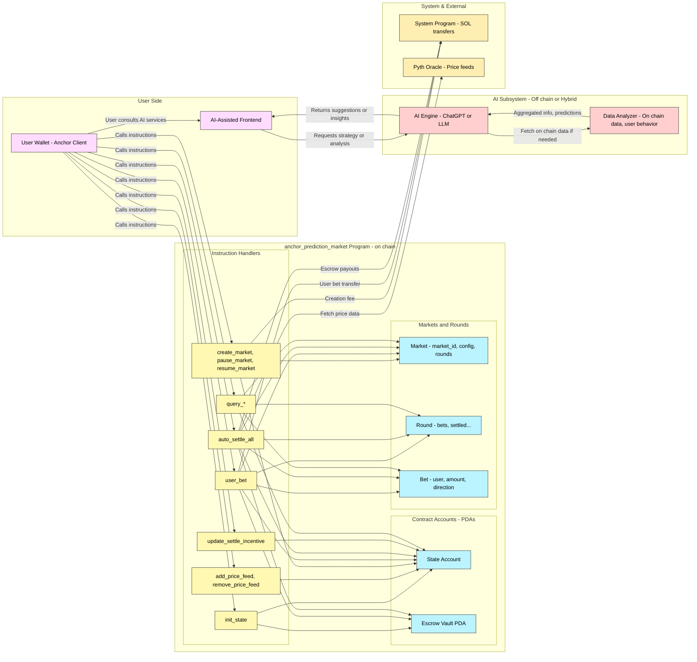

# System Architecture

## Raven AI Overview

```mermaid
flowchart LR
    %% Subgraph: User Interaction Layer
    subgraph A[User Interaction Layer]
    A1([DApp UI<br/>Web/Mobile])
    A2([IM/Chat/Voice/RTC])
    end
    
    %% Subgraph: Data Sources
    subgraph B[Data Sources]
    B1[On-chain Data - transactions]
    B2[Pyth Oracle - Market Prices]
    B3[External APIs & Feeds - News, Social Media]
    end

    %% Subgraph: Data Ingestion & Processing
    subgraph C[Data Ingestion & Processing]
    C1[Data Aggregator]
    C2[Data Transformation<br/>Normalization, Cleaning]
    C3[Data Storage<br/>Database / Data Lake]
    end

    %% Subgraph: Raven AI - Core
    subgraph D[Raven AI - Core]
    D1[Raven AI Orchestrator]
    D2[Prediction Models<br/>ML & DL]
    D3[Behavioral Analysis<br/>User Patterns, Sentiment]
    D4[Knowledge Base<br/>Aggregated Data]
    end

    %% Subgraph: LLM & Inference Layer
    subgraph E[LLM & Inference Layer]
    E1[ChatGPT / GPT-like Model]
    E2[Prompt Engineering<br/>Context Builder]
    E3[Inference Engine<br/>API Gateway]
    end

    %% Subgraph: Feedback & Continuous Learning
    subgraph F[Feedback & Continuous Learning]
    F1[User Feedback<br/>Ratings, Votes, Comments]
    F2[Model Fine-tuning<br/>Reinforcement Learning]
    F3[Behavior Logging<br/>Clickstream, Results]
    end

    %% Flows between components
    A1 --> |User requests / queries / new prediction events| D1
    A2 --> |User chats / voice / social interaction| D1

    B1 --> |On-chain data| C1
    B2 --> |Real-time price and event data| C1
    B3 --> |News / social media / external indicators| C1

    C1 --> |Data ingestion| C2
    C2 --> |Cleaned / normalized data| C3
    C3 --> |Enriched dataset| D4

    D1 --> |Sub-tasks, data context| D2
    D1 --> |Analyze user behavior| D3
    D2 --> |Market predictions<br/>Probability outcomes| E3
    D3 --> |Behavior insights<br/>Decision patterns| E2
    D4 --> |Historical and contextual data| E2

    E2 --> |Construct prompts and context| E1
    E1 --> |Generated predictions, insights, strategies| E3
    E3 --> |LLM-based recommendations and output| D1

    D1 --> |AI-driven insights<br/>Strategies, analysis| A1
    D1 --> |Social / voice analysis| A2

    A1 --> |User results, performance data| F1
    A2 --> |User feedback, engagement| F1
    F1 --> |Improve user behavior models| D3
    F1 --> |Retrain or fine-tune models| F2
    F2 --> |Update ML / AI models| D2
    F2 --> |Refine AI orchestrator logic| D1
    F2 --> |Enrich knowledge base| D4
    F1 --> |Logs & usage metrics| C3

    %% Optional styling
    style A1 fill:#FFDCFF,stroke:#333,color:#000
    style A2 fill:#FFDCFF,stroke:#333,color:#000
    style B1 fill:#BBF3FF,stroke:#333,color:#000
    style B2 fill:#BBF3FF,stroke:#333,color:#000
    style B3 fill:#BBF3FF,stroke:#333,color:#000
    style C1 fill:#BFFFC8,stroke:#333,color:#000
    style C2 fill:#BFFFC8,stroke:#333,color:#000
    style C3 fill:#BFFFC8,stroke:#333,color:#000
    style D1 fill:#FFF8B2,stroke:#333,color:#000
    style D2 fill:#FFF8B2,stroke:#333,color:#000
    style D3 fill:#FFF8B2,stroke:#333,color:#000
    style D4 fill:#FFF8B2,stroke:#333,color:#000
    style E1 fill:#FFEEB2,stroke:#333,color:#000
    style E2 fill:#FFEEB2,stroke:#333,color:#000
    style E3 fill:#FFEEB2,stroke:#333,color:#000
    style F1 fill:#f9f,stroke:#333,color:#000
    style F2 fill:#f9f,stroke:#333,color:#000
    style F3 fill:#f9f,stroke:#333,color:#000
```

## Raven Prediction System

```mermaid
flowchart LR

    subgraph U[User Side]
    U1[User Wallet - Anchor Client]
    U2[AI-Assisted Frontend]
    end

    subgraph SC[anchor_prediction_market Program - on chain]
        direction TB
        
        subgraph Instr[Instruction Handlers]
        I1[init_state]
        I2[add_price_feed, remove_price_feed]
        I3[create_market, pause_market, resume_market]
        I4[user_bet]
        I5[auto_settle_all]
        I6[update_settle_incentive]
        I7[query_*]
        end
        
        subgraph DataAcc[Contract Accounts - PDAs]
        DA1[State Account]
        DA2[Escrow Vault PDA]
        end

        subgraph MarketStructs[Markets and Rounds]
        MS1[Market - market_id, config, rounds]
        MS2[Round - bets, settled...]
        MS3[Bet - user, amount, direction]
        end
    end

    subgraph AI[AI Subsystem - Off chain or Hybrid]
    AI1[AI Engine - ChatGPT or LLM]
    AI2[Data Analyzer - On chain data, user behavior]
    end

    subgraph SP[System & External]
    SP1[System Program - SOL transfers]
    SP2[Pyth Oracle - Price feeds]
    end

    U1 -->|User consults AI services| U2
    U2 -->|Requests strategy or analysis| AI1
    AI1 -->|Fetch on chain data if needed| AI2
    AI2 -->|Aggregated info, predictions| AI1
    AI1 -->|Returns suggestions or insights| U2

    U1 -->|Calls instructions| I1
    U1 -->|Calls instructions| I2
    U1 -->|Calls instructions| I3
    U1 -->|Calls instructions| I4
    U1 -->|Calls instructions| I5
    U1 -->|Calls instructions| I6
    U1 -->|Calls instructions| I7

    %% --- Instruction to PDAs
    I1 --> DA1
    I1 --> DA2
    I2 --> DA1
    I3 --> DA1
    I3 --> MS1
    I4 --> DA1
    I4 --> DA2
    I4 --> MS1
    I4 --> MS2
    I4 --> MS3
    I5 --> DA1
    I5 --> DA2
    I5 --> MS1
    I5 --> MS2
    I5 --> MS3
    I6 --> DA1
    I7 --> DA1
    I7 --> MS1
    I7 --> MS2
    I7 --> MS3

    I3 -->|Creation fee| SP1
    I4 -->|User bet transfer| SP1
    I5 -->|Fetch price data| SP2
    I5 -->|Escrow payouts| SP1

    classDef highlight fill:#FFF8B2,stroke:#333,stroke-width:1px,color:#000
    classDef account fill:#BBF3FF,stroke:#333,stroke-width:1px,color:#000
    classDef external fill:#FFEEB2,stroke:#333,stroke-width:1px,color:#000
    classDef user fill:#FFDCFF,stroke:#333,stroke-width:1px,color:#000
    classDef ai fill:#FFCFCF,stroke:#333,stroke-width:1px,color:#000
    
    class U1,U2 user
    class AI1,AI2 ai
    class I1,I2,I3,I4,I5,I6,I7 highlight
    class DA1,DA2,MS1,MS2,MS3 account
    class SP1,SP2 external

```

