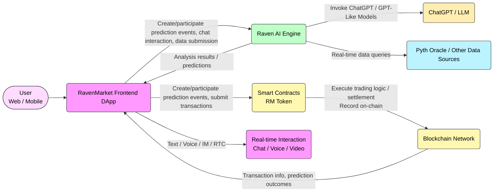
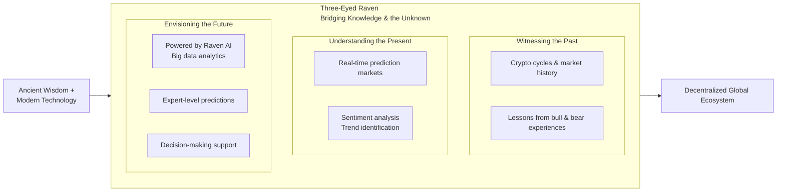
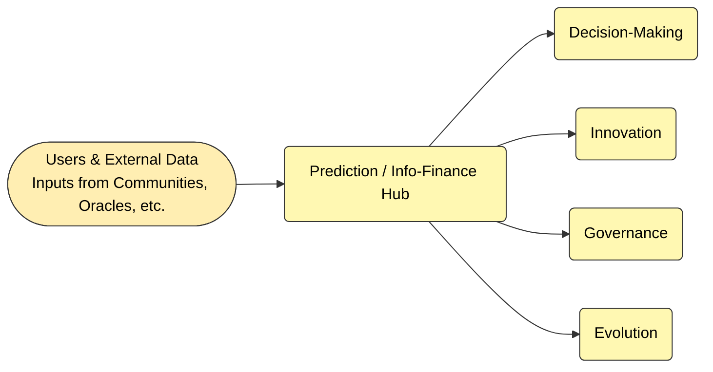
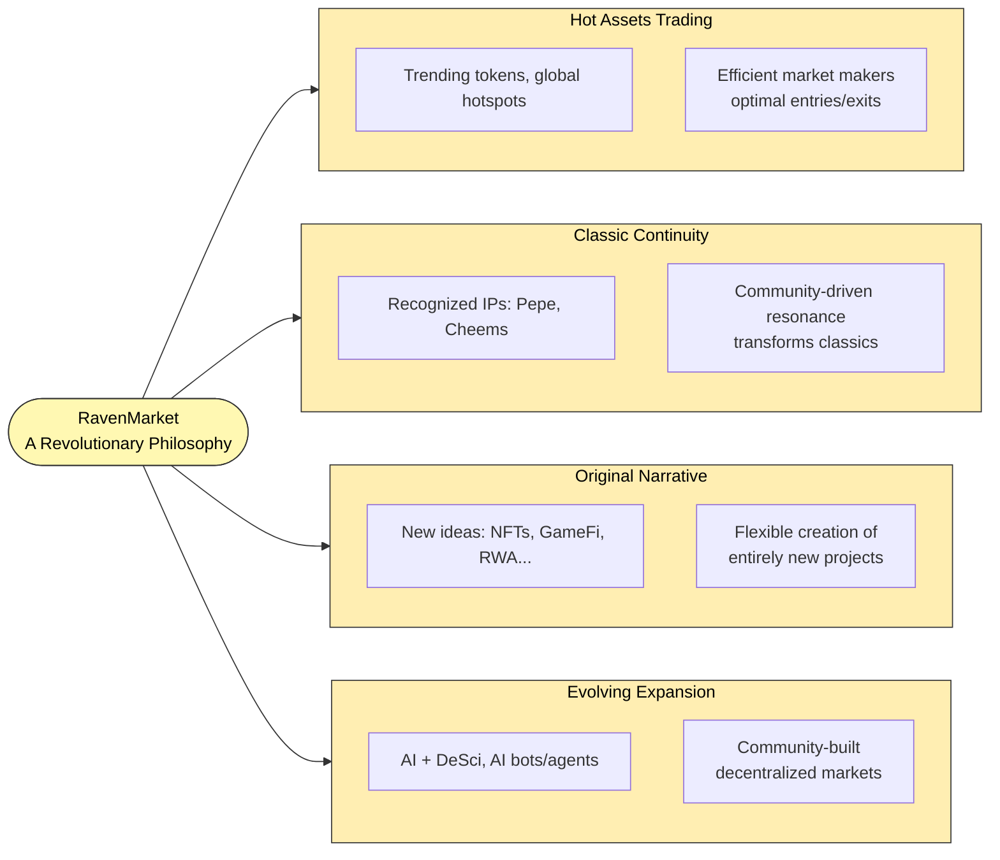
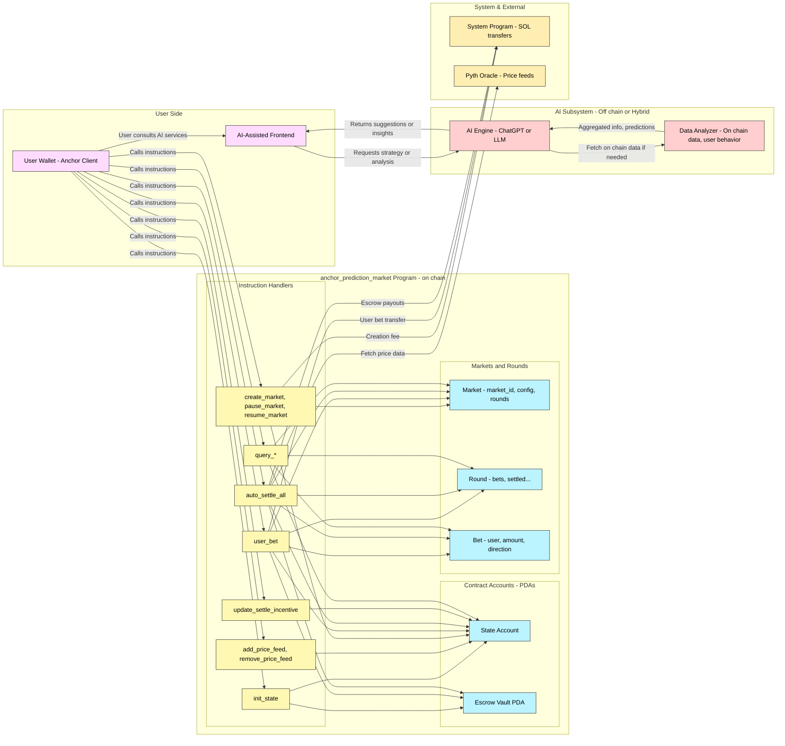

# System Architecture

## The Three-Eyed Raven: The Symbol of the Decentralized Era

The three-eyed raven transcends the ordinary, representing mastery over the past, present, and future. As a bridge between knowledge and the unknown, it merges ancient wisdom with modern technology, offering unmatched precision and foresight.

### **The First Eye – Witnessing the Past**

Drawing lessons from the crypto world’s cycles of bull and bear markets and the countless experiences that shaped the industry.

### **The Second Eye – Understanding the Present**

Deeply integrated with real-time prediction markets, it uncovers market sentiments and identifies developing trends.

### **The Third Eye – Envisioning the Future**

Powered by Raven AI, the platform analyzes vast datasets and user behavior to provide expert-level predictions and decision-making support.

## **Mission: Predictions Beyond Simple Bets**

In _From Prediction Markets to Information Finance_, Vitalik envisions a future where "prediction" is no longer just a simple vote or bet, but a fundamental element in how the world makes decisions, drives innovation, governs, and evolves.

RavenMarket is the key to unlocking this future:

* **Predict to Earn:** With AI-driven models, users can easily create prediction events without technical expertise. Early participants and liquidity providers are rewarded, sharing in the platform’s growth.
* **Pyth Oracle:** Ensuring real-time, authoritative data accuracy, RavenMarket is the only prediction platform fully powered by Pyth Oracle, offering unparalleled precision and reliability.
* **Raven AI:** Advanced AI algorithms mine data, track trends, and assist in decision-making. Whether you're a tech expert or a novice, you’ll have your own AI empowered Three-Eyed Raven, offering personalized insights.
* **Real-Time Social Interaction:** Through text, voice, IM, and RTC, users engage in dynamic discussions. Raven AI records and learns from trading habits and effective strategies, creating personalized data samples for better decision support.
* **Smart Contracts:** Transparent, on-chain transactions ensure every trade is publicly verifiable — no hidden agendas, just complete trust.
* **Value Sharing:** 50% of platform profits are allocated to buy back RM tokens, allowing every participant to become a co-creator of the ecosystem.

Unlike traditional "guess the trend" platforms, RavenMarket transforms prediction into a global "consensus experiment," blending collective intuition, experience, and AI algorithms to produce highly accurate outcomes. It allows information to evolve within a decentralized framework, fostering continuous innovation.

## **Scenarios: From Native to Expansive**

RavenMarket isn’t just a tool—it’s a revolutionary philosophy, bringing multidimensional value through market practice.

**Hot Assets Trading**

1. RavenMarket thrives on trending events, such as predictions on hot tokens' prices or global hotspots' outcomes.
2. Market makers efficiently capitalize on trends, entering and exiting at optimal moments.

**Classic Continuity**

1. Globally recognized IPs, such as Pepe or Cheems, find new life as prediction assets on RavenMarket.
2. Community-driven resonance ensures liquidity while transforming classics into innovative market experiences.

**Original Narrative**

1. Great autonomy and flexibility allow users to integrate new ideas and innovative concepts, such as NFTs, GameFi, RWA, and more, to create entirely new prediction projects.
2. With its endless supply of original content and creative possibilities, RavenMarket holds infinite potential.

**Evolving Expansion**

1. As AI continues to advance, RavenMarket is primed to incubate and develop more AI-driven projects, such as AI + DeSci, AI bots, AI agents and beyond.
2. Community-inspired projects can leverage RavenMarket’s infrastructure to build their own decentralized prediction markets.

\
RavenMarket’s strength lies in its continuous evolution. Unlike platforms confined to a single trend, RavenMarket constantly adapts and grows, incorporating new prediction scenarios and enhancing user interactions. This dynamic expansion ensures that RM tokens retain long-term value, while empowering users to explore an ever-expanding digital universe.

With RavenMarket, the future isn’t just imagined—it’s predicted, shared, and shaped by everyone.

## Raven AI Overview

## Raven Prediction System

